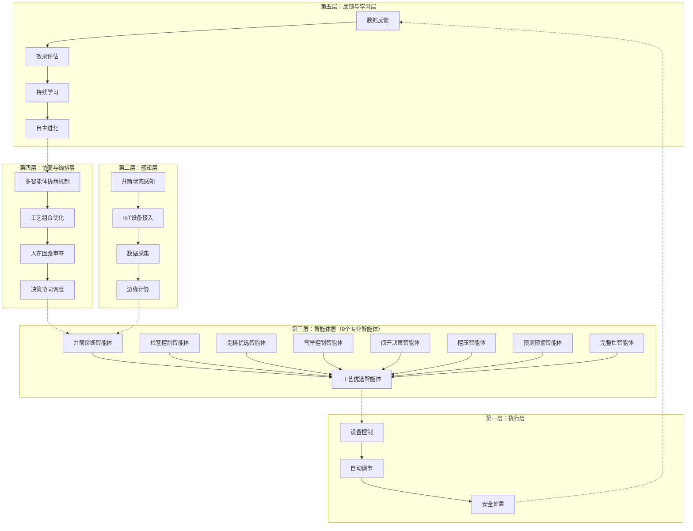
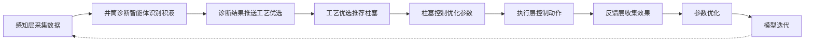
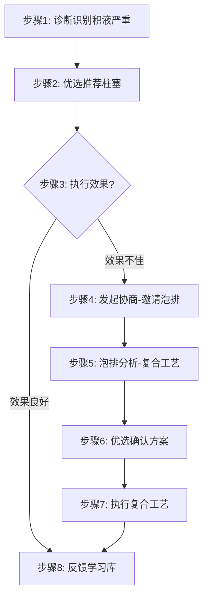
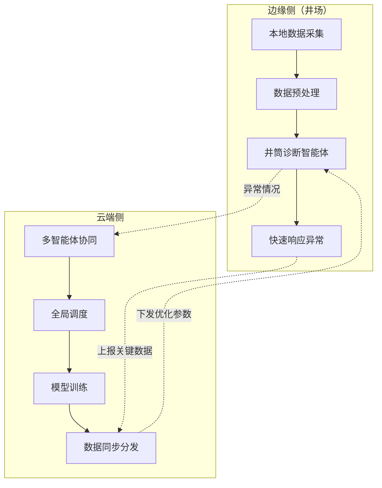
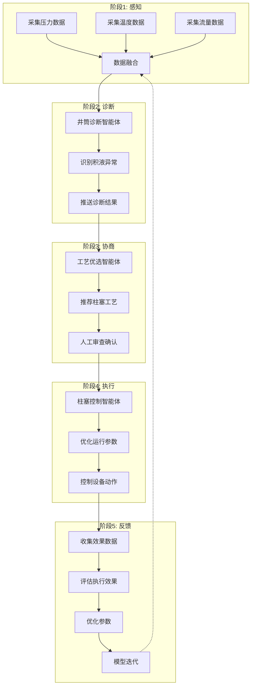
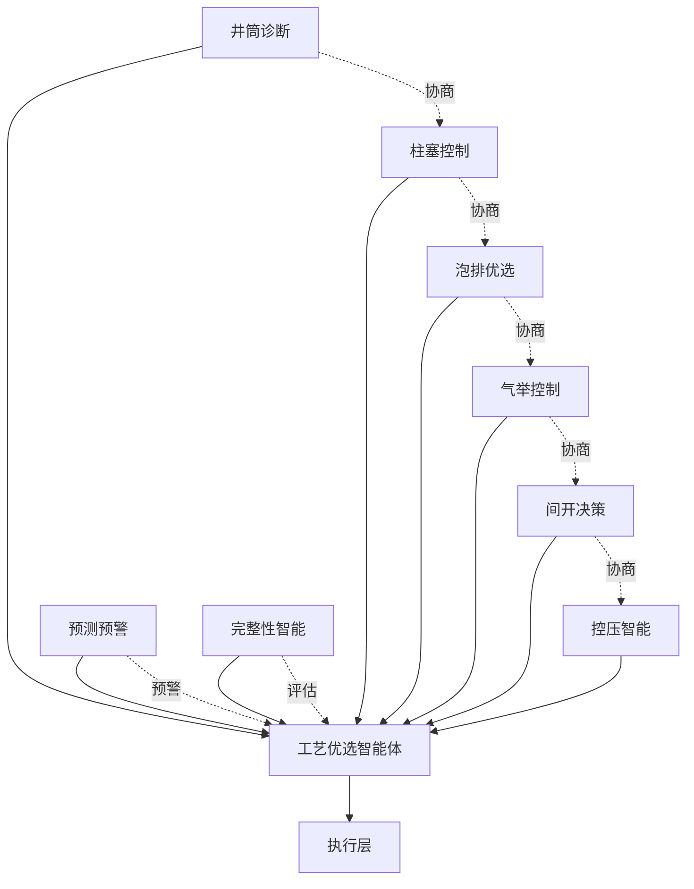
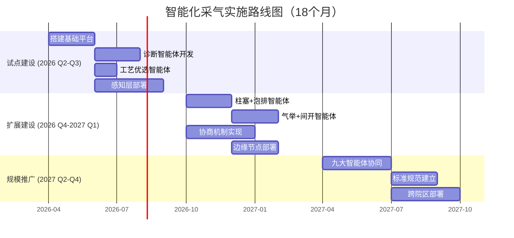

# 智能化采气系统技术架构图（Mermaid版本）

## 五层技术架构图

---

## 多智能体协同决策流程图

---

## 智能体协商示例流程

---

## 边缘+云端协同架构

---

## 智能体闭环流程动画

---

## 九大智能体关系图

---

## 智能化采气实施路线图

---

**使用说明**：
1. 以上Mermaid图表可以直接复制到飞书文档中渲染
2. 飞书文档支持Mermaid语法，会自动生成流程图
3. 如果需要更精美的图片，我也可以使用COZE图片生成工具创建示意图
4. 动画演示可以通过Mermaid的sequence diagram或生成GIF实现

您需要我将这些图表：
- A. 直接粘贴到这个消息中？
- B. 还是推送到GitHub仓库？
- C. 或者需要生成更精美的图片格式？
