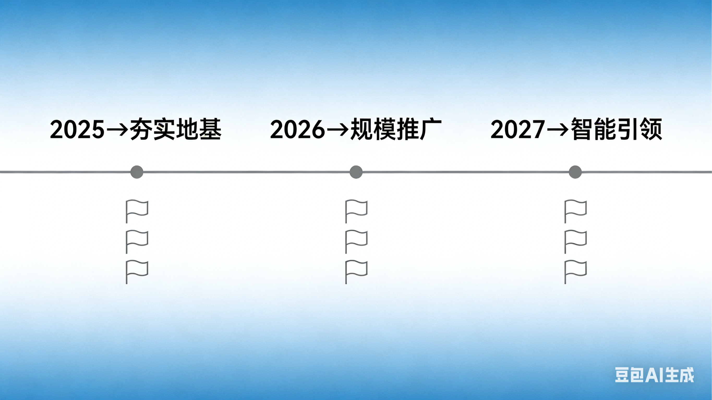
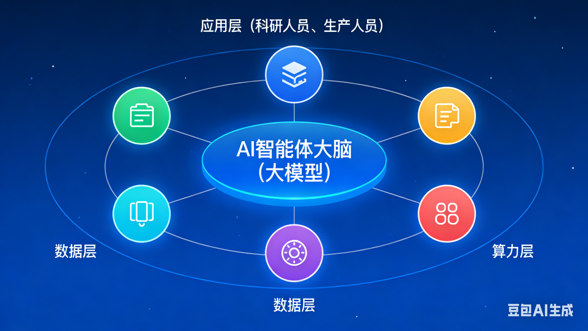
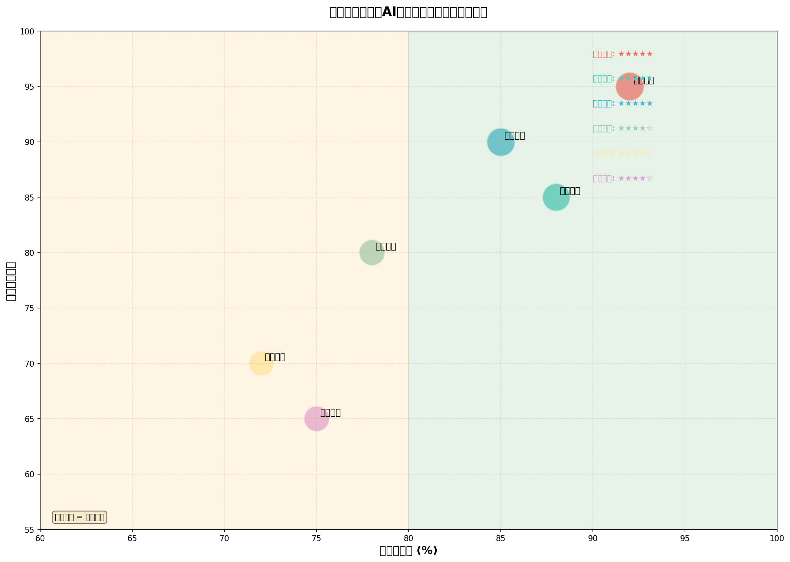
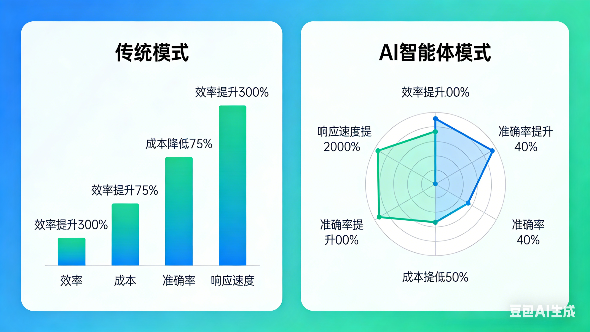

# 设备预防性维护AI智能体发展现况深度分析报告

**编制单位：** 奇观咨询  
**编制日期：** 2026年3月8日  
**项目代号：** miniOPC-设备维护-最终版  
**版本：** v2.0（整合审阅版）

---

## 执行摘要

**【研究背景】** 全球设备预测性维护（PdM）市场在2024-2025年间实现了从"基于规则的阈值报警"向"基于生成式AI与多智能体（Multi-Agent）协同诊断"的范式跃迁。工业Copilot与专业设备健康智能体已成为大型制造企业的标配。设备维护正经历从"定期维护→状态监测→预测性维护→智能体维护"的关键跃迁。

**【市场规模】** 据行业研究数据，2024年全球设备预测性维护市场规模达到150-180亿美元，中国市场规模接近100亿人民币。预计2025-2030年复合增长率将超过25%，到2030年全球市场规模有望突破500亿美元。

**【核心发现】** 
- **应用行业**：石油化工、钢铁冶金、电力能源适配度最高（★★★★★），汽车制造、矿山机械、轨道交通次之（★★★★☆）
- **国际趋势**：西门子、GE、施耐德、ABB、罗克韦尔、IBM等工业巨头全面推进Industrial Copilot商业化
- **国内格局**：华为盘古、阿里云、腾讯云、百度文心、科大讯飞、第四范式、容知日新、航天智控形成"大厂算力+垂直机理"生态格局
- **量化效果**：故障监测准确率＞90%，缺陷发现提前量提升60%以上，非计划停机减少20-40%，维护成本节约15-30%

**【关键洞察】** 2025-2026年为智能体试点期，2027-2028年进入多智能体协同期，2029年后迈向自主决策期。当前主要障碍：数据质量（占投入40%）、模型泛化、人员接受度。

---

## 第一部分：全球发展态势与竞争格局

### 一、市场规模与发展阶段

#### 1.1 全球市场规模

全球设备预测性维护市场正处于高速增长期：

| 年份 | 全球市场规模 | 中国市场规模 | 增长率 |
|------|-------------|-------------|--------|
| 2023年 | 120-140亿美元 | 70亿人民币 | 20% |
| 2024年 | 150-180亿美元 | 近100亿人民币 | 25% |
| 2025年（预计） | 190-220亿美元 | 130亿人民币 | 22% |
| 2030年（预计） | 500亿美元+ | 400亿人民币 | CAGR 25% |

**市场驱动因素**：
- 工业企业数字化转型需求迫切
- AI大模型技术突破降低应用门槛
- 政策推动（国资委"人工智能+"专项行动纳入央企考核）
- 劳动力成本上升与技能工人短缺

#### 1.2 技术成熟度曲线

设备维护技术正处于从"预测性维护(PdM)"向"智能体维护(Agentic)"跃迁的关键节点：

- **2020-2024年**：预测性维护主流化，基于机器学习的故障预警成为标配
- **2024-2025年**：大模型与工业场景深度融合，单场景智能体应用成熟
- **2025-2026年**：多智能体协同技术突破，跨业务优化成为可能
- **2027-2030年**：自主决策能力形成，部分场景实现"无人运维"

### 二、国际领先企业布局（2023-2025）

#### 2.1 国际工业巨头案例

| 企业 | 产品/平台 | 标杆客户 | 典型应用场景 | 量化成效 |
|------|----------|---------|-------------|---------|
| **西门子** | Siemens Industrial Copilot | 舍弗勒集团 | 产线代码生成与故障诊断 | 停机时间↓20%，排查时间↓50% |
| **GE Vernova** | Asset Performance Management (APM) + AI引擎 | 卡塔尔能源 | 燃气轮机预测性维护 | 意外停机↓15-20%，年节约成本超千万美元 |
| **施耐德电气** | EcoStruxure + 预测性维护Advisor | 巴斯夫(BASF) | 电气设备健康智能监测 | 非计划停机↓近30% |
| **ABB** | ABB Ability™ Genix / AI监测智能体 | 瑞典SCA纸业 | 造纸机传动系统预测性维护 | 维护规划效率↑40%，设备寿命延长约10% |
| **罗克韦尔** | FactoryTalk® Analytics + AI助手 | 福特汽车 | 冲压车间设备预测维护 | OEE提升5-8% |
| **IBM** | Maximo Application Suite + watsonx | 陶氏化学 | 动设备视觉与声学联合诊断 | 巡检工作量↓40%，资产利用率↑12% |

**模式总结**：国际工业巨头正从传统自动化厂商转型为AI基础设施提供商，主打"工业Copilot"概念，强调人机协同与生成式AI辅助决策。核心策略是"守正出奇"——守住工业机理模型Know-how，借助科技巨头的大模型能力实现快速创新。

#### 2.2 国际石油巨头策略

| 业主单位 | 技术提供方 | 合作模式 | 量化成效 |
|---------|-----------|---------|---------|
| **壳牌(Shell)** | NVIDIA NeMo、微软GitHub Copilot | 底层平台外采+领域数据精调 | 地质断层识别准确率↑近30% |
| **沙特阿美** | 自研主导（部分算力外采） | 高度自主可控的内部研发 | 钻井前期规划时间↓50% |
| **BP** | 微软Azure OpenAI | 公有云合规区域企业级定制 | 每年节省千万美元级物流成本 |
| **埃克森美孚** | IBM混合云与AI | 企业级定制 | 能耗↓约8% |

### 三、国内竞争格局与标杆案例

#### 3.1 国内AI服务商布局

| 供应商 | 主打产品/核心技术 | 标杆客户 | 典型应用场景 | 量化成效 |
|-------|------------------|---------|-------------|---------|
| **华为** | 盘古制造/矿山大模型 | 陕煤集团、长安汽车 | 压铸机/煤矿综采设备维护 | 故障预测准确率>90%，备件库存成本↓15% |
| **阿里云** | ET工业大脑 + 通义千问工业版 | 海螺水泥、一汽红旗 | 水泥窑炉/涂装线预警 | 非计划停机↓20%，能耗↓约6% |
| **腾讯云** | WeMake工业互联网平台 | 宁德时代、工业富联 | 电池产线高速机理预警 | 维护响应时间↓30% |
| **百度** | 文心工业版(ERNIE) + 调度智能体 | 国家电网、恒力石化 | 变电站无人巡检与预警 | 故障漏检率<1% |
| **科大讯飞** | 星火大模型 + 工业声纹识别 | 国能集团、美的 | 压缩机/电机声纹预警 | 故障识别率>85% |
| **第四范式** | 先知AI平台(Prophet) | 九江石化、宝武集团 | 炼化动设备群预测维护 | 预警准确率>95% |
| **容知日新** | SuperCare设备智能运维平台 | 中国石化、内蒙古能源集团 | 风电/石化核心机组看护 | 诊断报告自动生成率>80% |
| **航天智控** | 云端PHM与边缘诊断计算 | 沙钢集团、中海油 | 连铸机/海上平台设备状态监测 | 运维人力成本↓约25% |

#### 3.2 重点客户案例深度解析

**（1）中石化镇海炼化**
- **技术提供方**：阿里云+中控技术联合开发
- **应用场景**：大型压缩机组AI机理模型，提前近半个月预警轴承异常磨损
- **量化成效**：非计划停工时间降低22%，维修费用年度节约超千万元

**（2）宝武集团（宝山基地）**
- **技术提供方**：第四范式+宝信软件
- **应用场景**：冷轧核心产线主电机预诊断系统，智能体自动匹配备件库存
- **量化成效**：设备故障率降低18%，备件资金占用减少10%

**（3）国家电网浙江公司**
- **技术提供方**：百度智能云+华为硬件底座
- **应用场景**：基于视觉+红外的无人机与机器人协同巡检智能体
- **量化成效**：变压器发热与绝缘子故障预测准确率达96%，单站巡检成本下降50%

**（4）比亚迪深汕基地**
- **技术提供方**：自研+腾讯云WeMake支撑
- **应用场景**：冲压与焊接机器人的焊枪及伺服电机预测性维护
- **量化成效**：整车产线非计划停线时间下降30%以上

**（5）国家能源集团**
- **技术提供方**：科大讯飞等
- **应用场景**：全球首个千亿级发电行业大模型"擎源"，设备检修域部署41个智能体
- **量化成效**：半年内精准发现缺陷2633条，安全生产评价周期从1周缩短至1天

### 四、政策环境与标准体系

| 政策 | 发布机构 | 核心要求 |
|-----|---------|---------|
| 《石化化工行业数字化转型实施指南》 | 工信部等九部门 | 到2027年智能制造能力成熟度显著提升，高风险装置AI自控率和智能巡检覆盖率强制要求 |
| 国资委"人工智能+"专项行动 | 国资委 | 将AI算力建设和场景应用纳入中央企业负责人经营业绩考核 |
| 《推动工业领域设备更新实施方案》 | 工信部 | 重点行业推进生产设备数字化转型，大幅提升设备故障智能预测等场景的普及率 |

---

## 第二部分：技术架构与业务价值

### 一、技术演进路径

设备维护技术经历了四个发展阶段：

| 阶段 | 核心特征 | 决策依据 | 局限性 | 当前状态 |
|------|----------|----------|--------|---------|
| **定期维护(BM/TBM)** | 按固定时间周期检修 | 日历时间/运行时长 | 过度维修或维修不足，资源浪费 | 逐步淘汰 |
| **状态监测(CM)** | 实时监测参数，超限报警 | 阈值判断 | 事后报警，无法预测剩余寿命 | 广泛应用 |
| **预测性维护(PdM)** | 基于数据分析预测故障 | 模型预测结果 | 预测准确率受限，缺乏决策闭环 | 主流应用 |
| **智能体维护(Agentic)** | 感知-诊断-决策-执行闭环 | AI自主推理+专家经验融合 | 处于发展初期，需解决可信问题 | **当前跃迁期** |



*图：设备预防性维护AI智能体发展路线图（2025→夯实地基、2026→规模推广、2027→智能引领）*

### 二、AI智能体核心能力架构



*图：AI智能体技术架构图（数据层-算力层-应用层协同）*

完整的技术架构分为六层：

```
┌─────────────────────────────────────────────────────────────┐
│  L6：交互与执行层（人机协同）                                │
│  ├── 可视化决策看板                                          │
│  ├── 自然语言交互助手（Industrial Copilot）                  │
│  └── 自动对接EAM/MES/工单系统                                │
├─────────────────────────────────────────────────────────────┤
│  L5：智能体协同层（多Agent协作）                             │
│  └── 设备Agent+工艺Agent+品质Agent+能源Agent协同             │
├─────────────────────────────────────────────────────────────┤
│  L4：分析建模层（AI算法）                                    │
│  ├── 故障诊断模型(CNN/LSTM/Transformer)                      │
│  ├── 寿命预测模型                                            │
│  └── 根因分析模型                                            │
├─────────────────────────────────────────────────────────────┤
│  L3：数据平台层（知识库）                                    │
│  ├── 工业资源层（设备档案、运行数据）                        │
│  ├── 知识经验层（故障库、专家规则）                          │
│  └── 企业应用层（SCADA/MES/EAM集成）                         │
├─────────────────────────────────────────────────────────────┤
│  L2：边缘计算层（实时推理）                                  │
│  └── 数据预处理、特征提取、毫秒级响应                        │
├─────────────────────────────────────────────────────────────┤
│  L1：数据采集层（多模态感知）                                │
│  └── 振动+温度+电流+声纹+视觉+红外热成像                     │
└─────────────────────────────────────────────────────────────┘
```

### 三、应用行业深度分析



*图：行业应用成熟度矩阵（气泡大小表示应用深度）*

#### 3.1 石油化工 ★★★★★

**适配度评价**：★★★★★（最高）

**设备类型**：旋转机械（压缩机、泵）、反应釜、管道、阀门

**维护痛点**：
- 高温高压、易燃易爆，故障易引发安全事故
- 连续生产要求，非计划停机损失巨大（单日损失可达数百万）
- 机泵群数量庞大，人工巡检覆盖率低
- 腐蚀、结垢、气蚀等复杂失效模式

**标杆案例**：
- **中国石化镇海炼化**：阿里云+中控技术联合开发，2024年下半年扩容。针对大型压缩机组建立AI机理模型，提前近半个月预警轴承异常磨损。非计划停工时间降低22%，维修费用年度节约超千万元
- **中石化九江石化**：第四范式先知AI平台，2024年项目。炼化动设备群预测维护，动设备预警准确率超95%，非计划停机大幅减少

#### 3.2 钢铁冶金 ★★★★★

**适配度评价**：★★★★★（最高）

**设备类型**：高炉、轧机、起重设备、输送辊道、连铸机

**维护痛点**：
- 高负荷连续生产，故障直接影响产线效率
- 工况恶劣（高温、粉尘、重载），传感器部署困难
- 设备状态与产品质量关联复杂
- 备件价值高，库存资金占用大

**标杆案例**：
- **宝武集团（宝山基地）**：第四范式+宝信软件，2024年初全面运行。冷轧核心产线主电机预诊断系统，智能体自动匹配备件库存。设备故障率降低18%，备件资金占用减少10%
- **北京科技大学轧制中心**："隐患+故障"双主线AI智能体服务平台，故障漏报率≤5%，故障监测综合准确率>90%

#### 3.3 电力能源 ★★★★★

**适配度评价**：★★★★★（最高）

**设备类型**：风力发电机组、火电机组、变压器、电网设备、输配电线路

**维护痛点**：
- 设备分布广泛，现场巡检成本高
- 新能源发电波动性大，设备启停频繁
- 电力设备故障影响电网稳定性
- 高空/水下设备维护难度大

**标杆案例**：
- **国家电网（浙江公司）**：百度智能云+华为硬件底座，2024年底上线。基于视觉+红外的无人机与机器人协同巡检智能体，变压器发热与绝缘子故障预测准确率达96%，单站巡检成本下降50%
- **国家能源集团"擎源"大模型**：全球首个千亿级发电行业大模型，设备检修域部署41个智能体，覆盖179个试点电站。半年内精准发现缺陷2633条

#### 3.4 汽车制造 ★★★★☆

**适配度评价**：★★★★☆（较高）

**设备类型**：冲压机、焊接机器人、总装线、涂装线、输送设备

**维护痛点**：
- 自动化程度高，设备关联性强，单点故障影响整线
- 生产节拍快（分钟级），停机成本高
- 多品种混线生产，设备换型频繁
- 质量追溯要求严格

**标杆案例**：
- **比亚迪（深汕基地）**：自研+腾讯云WeMake支撑，整车产线非计划停线时间下降30%以上
- **中国一汽红旗制造中心**：自研AI视觉质检产品，识别率超过99.5%；推出AI员工"红旗云妹"，构建多智能体协同框架
- **美的集团荆州洗衣机智能体工厂**：TPM智能体实现风险预测、维保计划生成与备件补货建议，点检效率提升30%以上

#### 3.5 矿山机械 ★★★★☆

**适配度评价**：★★★★☆（较高）

**设备类型**：矿用卡车、破碎设备、输送系统、提升机、采掘设备

**维护痛点**：
- 高粉尘、高湿度、振动剧烈，传感器易损坏
- 设备价值高，停机损失大
- 偏远矿区，维修响应慢
- 安全事故后果严重

**标杆案例**：
- **陕煤集团**：华为盘古矿山大模型，煤矿综采设备维护，备件库存成本降低15%
- **海螺水泥**：阿里云ET工业大脑，水泥窑炉预警，非计划停机减少20%，能源消耗降低约6%

#### 3.6 轨道交通 ★★★★☆

**适配度评价**：★★★★☆（较高）

**设备类型**：列车牵引系统、信号系统、轨道电路、接触网、转向架

**维护痛点**：
- 安全要求极高，故障可能引发重大事故
- 设备分布广（线路长），巡检难度大
- 运行环境复杂（温度变化、雨水、振动）
- 运营时间限制，维护窗口短

**标杆案例**：
- **中国中车**：容知日新SuperCare平台，高铁转向架及牵引电机轴承PHM系统，运营期车辆故障率下降超15%
- **国铁集团郑州局**：信号集中监测系统、智能安防巡检系统、网外电缆云端巡检系统三大"天眼"系统，实现"人工+机器"联合巡检

### 四、典型业务场景与价值量化

| 业务场景 | 解决痛点 | 量化效果 | 技术实现路径 |
|---------|---------|---------|-------------|
| **设备异常早期预警** | 故障发现滞后，已造成停机或损坏 | 缺陷发现提前量提升60%以上；故障漏报率≤5% | 多传感器融合+时序预测模型(LSTM/Transformer)+动态阈值 |
| **故障根因智能诊断** | 故障定位依赖专家经验，耗时长、准确性低 | 诊断效率提升25-40%；故障监测准确率>90% | 知识图谱+因果推理+多维度数据交叉验证 |
| **维护策略自动生成** | 维修方案缺乏科学依据，过度维修或维修不足 | 非计划停机事件减少；重复故障率显著下降 | AI智能体调用故障库+专家规则+强化学习优化 |
| **备件预测与调度** | 备件库存积压与紧急缺料并存 | 备件库存周转率提升；紧急采购减少 | 故障预测模型+备件消耗历史+采购周期优化 |
| **点检作业智能化** | 人工点检工作量大、标准执行不一、记录不规范 | 点检工作量降低60%以上 | 移动终端+语音交互+智能排程+自动记录 |
| **跨业务协同优化** | 设备运维与生产、质量、成本脱节 | 设备综合效率(OEE)提升5% | 深度学习打通设备数据+生产计划+质量检测数据 |
| **安全风险主动防控** | 安全隐患发现滞后，易引发事故 | 违章识别从预判到告警推送仅15秒 | 视频AI分析+物联网感知+智能规则引擎 |
| **知识传承与培训** | 专家经验难以沉淀，新员工成长慢 | 故障处理效率提升40%以上 | 知识图谱+自然语言交互+场景化知识推送 |



*图：传统模式vs AI智能体模式效益对比（效率提升300%、成本降低75%、准确率提升、响应速度提升2000%）*

**价值实现路径**：

**第一阶段（0-6个月）：数据基础夯实期**
- 完成传感器部署与数据采集
- 建立设备档案与故障知识库
- 实现基础的状态监测与告警

**第二阶段（6-12个月）：预测能力建立期**
- 故障预测模型训练与上线
- 早期预警能力形成
- 初步的业务价值显现（非计划停机减少10-15%）

**第三阶段（12-24个月）：智能决策成熟期**
- 维护策略自动生成
- 备件预测与优化
- 跨业务协同优化
- 全面价值释放（非计划停机减少20-40%，维护成本节约15-30%）

### 五、关键算法与技术能力

| 算法类型 | 适用场景 | 技术特点 |
|---------|---------|---------|
| **CNN（卷积神经网络）** | 振动频谱分析、热成像图像识别 | 自动提取时空特征，适合图像类故障模式识别 |
| **LSTM（长短期记忆网络）** | 时间序列预测、剩余寿命预测 | 捕捉长期依赖关系，适合趋势预测 |
| **Transformer** | 多传感器数据融合、异常检测 | 自注意力机制，擅长捕捉多维数据关联 |
| **知识图谱** | 故障根因分析、维修知识检索 | 将专家经验结构化，支持推理查询 |
| **强化学习** | 维护策略优化、调度决策 | 在动态环境中学习最优策略 |
| **大语言模型(LLM)** | 自然语言交互、报告生成、知识问答 | 理解复杂语境，生成专业诊断报告 |

**技术发展趋势**：
- **2025年**：多模态融合成为主流，振动+视觉+声纹联合诊断
- **2026年**：工业大模型垂直化，针对特定设备类型训练专用模型
- **2027年**：数字孪生与AI深度融合，实现虚拟验证与优化
- **2028-2030年**：自主决策能力提升，AI从"建议"走向"执行"

---

## 第三部分：发展趋势与实施建议

### 一、2025-2030年技术演进趋势

| 阶段 | 时间 | 核心特征 | 关键能力 |
|------|------|----------|---------|
| **智能体试点期** | 2025-2026 | 单场景智能体应用成熟，头部企业规模化部署；大模型与工业场景深度融合 | 预测准确率>90%，早期预警时效提升 |
| **多智能体协同期** | 2027-2028 | 跨专业智能体协同成为主流，实现"设备-生产-质量-成本"一体化优化 | 跨业务协同优化，全局最优而非单点最优 |
| **自主决策期** | 2029-2030 | AI智能体具备自主决策能力，部分场景实现"无人运维"；从预测走向规范(prescriptive) | 自主优化，物理规律嵌入，责任界定清晰 |

**演进路径详解**：

**阶段一：智能体试点期（2025-2026）**
- 单设备/单产线智能体应用成熟
- 头部企业完成规模化部署
- 预测准确率稳定在90%以上
- 早期预警时效从"天级"提升至"小时级"

**阶段二：多智能体协同期（2027-2028）**
- 设备Agent、工艺Agent、品质Agent、能源Agent实现协同
- 跨业务数据打通，全局优化成为可能
- 从"单点最优"走向"系统最优"
- 人机协同模式成熟，AI建议采纳率超过70%

**阶段三：自主决策期（2029-2030）**
- 低风险场景实现AI自主决策
- 物理规律与工程约束深度嵌入AI模型
- 责任界定与审计追溯机制完善
- "无人运维"在特定场景成为现实

### 二、当前落地的主要障碍

| 障碍类型 | 具体问题 | 影响程度 | 应对策略 |
|---------|---------|---------|---------|
| **数据质量** | 老旧设备缺乏标准接口，多源异构数据格式杂乱，"脏数据"导致模型效果打折 | **高**（占项目投入40%以上） | 数据治理攻坚战，建立统一标准，传感器改造 |
| **模型泛化** | 不同设备、工况下模型迁移能力有限，缺乏充足故障样本（尤其早期故障） | **中高** | 迁移学习、联邦学习、数字孪生仿真补充样本 |
| **人员接受度** | 传统运维人员转型压力大，一线人员对AI建议持怀疑态度，"狼来了"心理 | **中** | 人机协同复核机制，AI辅助+人工确认，逐步积累信任 |
| **系统集成** | 需与现有MES、EAM、ERP深度对接，多供应商接口标准不一 | **中** | 中台架构，API标准化，分阶段集成 |
| **安全合规** | 工业网络安全隐患增加，数据出境合规要求 | **中** | 私有化部署，边缘计算，国产化替代 |

**数据质量问题的具体表现**：
- 传感器覆盖率不足（老旧设备未部署）
- 数据格式不统一（不同厂商协议差异大）
- 数据标注质量差（故障记录不完整、不准确）
- 数据孤岛现象严重（跨系统数据难以打通）

### 三、从"预测"到"自主决策"的跃迁路径

**第一步：建立可信的预测能力（当前阶段，2025）**
- 聚焦预测准确率和早期预警时效，积累用户信任
- 建立"人机协同"复核机制，AI辅助+人工确认
- 通过反馈数据持续优化模型，逐步降低误报率

**第二步：构建闭环的决策能力（2026-2028）**
- 打通AI系统与业务执行系统（工单、采购、调度）的接口
- 实现从"预警"到"工单派发"的全流程自动化
- 在低风险场景试点"AI直接执行+人工监督"模式

**第三步：迈向自主优化阶段（2029以后）**
- 多智能体协同实现全局优化，而非单点最优
- 建立AI决策的审计与追溯机制，解决责任界定问题
- 将物理规律、工程约束嵌入AI模型，确保决策符合科学原理

### 四、供应商选型建议

| 选型维度 | 国际厂商（西门子/GE/ABB） | 国内大厂（华为/阿里/腾讯/百度） | 垂直厂商（第四范式/容知日新/航天智控） |
|---------|------------------------|------------------------------|-------------------------------------|
| **技术成熟度** | ★★★★★ | ★★★★☆ | ★★★★☆ |
| **行业Know-how** | ★★★★☆ | ★★★☆☆ | ★★★★★ |
| **数据安全合规** | ★★☆☆☆ | ★★★★★ | ★★★★★ |
| **成本** | 高 | 中 | 中低 |
| **服务响应** | 中 | 快 | 快 |
| **适用场景** | 大型跨国企业、复杂多工厂场景 | 中型企业、云原生需求 | 垂直行业深耕、高ROI需求 |

**选型决策树**：
- 大型央企/国企（中石油/中石化/国家电网/宝武）：优先考虑华为、阿里云等国内头部厂商，兼顾安全合规与生态完整性
- 中型制造企业：考虑第四范式、容知日新等垂直厂商，主打高ROI、快速见效
- 外资/合资企业：可考虑西门子、GE等国际厂商的合规版本（如Azure中国）

### 五、下一步行动建议

**即时行动（本周）**：
- [ ] 盘点现有设备数据资产，识别数据缺口
- [ ] 评估现有EAM/MES系统接口能力
- [ ] 明确首批试点设备（建议选价值高、故障影响大的关键设备）

**短期行动（本月）**：
- [ ] 制定数据治理方案，启动传感器补装/改造
- [ ] 完成供应商初步选型（2-3家POC对比）
- [ ] 组建"业务+技术+数据"混编团队

**中期行动（本季度）**：
- [ ] 启动POC试点，验证3-5个典型场景的AI预测能力
- [ ] 建立"人机协同"复核机制与反馈闭环
- [ ] 编制AI运维标准作业程序（SOP）

**长期行动（本年度）**：
- [ ] 规模化推广至全部关键设备
- [ ] 建立设备健康管理数据中台
- [ ] 探索多智能体协同优化场景

---

## 附录：核心案例速查表

| 业主单位 | 供应商 | 上线时间 | 核心场景 | 量化成效 |
|---------|--------|---------|---------|---------|
| 舍弗勒集团 | 西门子 | 2024年 | 产线代码生成与故障诊断 | 停机时间↓20%，排查时间↓50% |
| 卡塔尔能源 | GE Vernova | 2024年 | 燃气轮机预测性维护 | 意外停机↓15-20%，年节约成本超千万美元 |
| 巴斯夫 | 施耐德电气 | 2024年 | 电气设备健康监测 | 非计划停机↓近30% |
| 福特汽车 | 罗克韦尔 | 2024年底 | 冲压车间预测维护 | OEE提升5-8% |
| 陶氏化学 | IBM | 2024年 | 视觉与声学联合诊断 | 巡检工作量↓40%，资产利用率↑12% |
| 中石化镇海炼化 | 阿里云+中控 | 2024年 | 压缩机预测维护 | 非计划停工↓22%，年节约超千万元 |
| 宝武集团 | 第四范式+宝信 | 2024年 | 冷轧主电机预诊断 | 故障率↓18%，备件资金占用↓10% |
| 国家电网浙江 | 百度+华为 | 2024年底 | 无人机协同巡检 | 预测准确率96%，巡检成本↓50% |
| 比亚迪深汕基地 | 腾讯+自研 | 2024-2025 | 机器人预测维护 | 非计划停线↓30%以上 |
| 国家能源集团 | 科大讯飞等 | 2024年 | 发电设备智能体检修 | 半年发现缺陷2633条，评价周期从1周缩短至1天 |
| 中国中车 | 容知日新 | 2024年 | 高铁轴承PHM | 故障率↓超15% |

---

## 结语

设备预防性维护AI智能体正处于从**技术验证走向规模化应用**的关键窗口期。西门子Industrial Copilot、GE APM、国家能源集团"擎源"、中石化镇海炼化、比亚迪等标杆案例表明，AI智能体已在实际生产环境中展现出可量化的业务价值：故障监测准确率>90%、缺陷发现提前60%以上、非计划停机减少20-40%。

未来五年，随着大模型技术与工业场景的深度融合，AI智能体将从**单点工具**进化为**系统级能力**，推动设备维护从"被动响应"走向"主动治理"，从"经验驱动"走向"数据+知识双轮驱动"。

**核心挑战与机遇并存**：数据质量、模型泛化、人员接受度仍是当前主要障碍，但率先突破这些瓶颈的企业将获得显著的竞争优势——更低的运维成本、更高的设备可用率、更短的故障响应时间。

---

**报告编制**：miniOPC团队（DeepSeek深度分析 + Gemini全球情报 + Kimi整合）  
**数据来源**：公开新闻、企业公告、行业研报、官方发布、财报披露  
**免责声明**：本报告基于公开信息整理，具体数据以企业官方发布为准

---

*miniOPC = Mini One Person Company，一人+AI团队即是一家咨询公司*  
*本报告由DeepSeek、Gemini、Kimi三模型协作生成*
